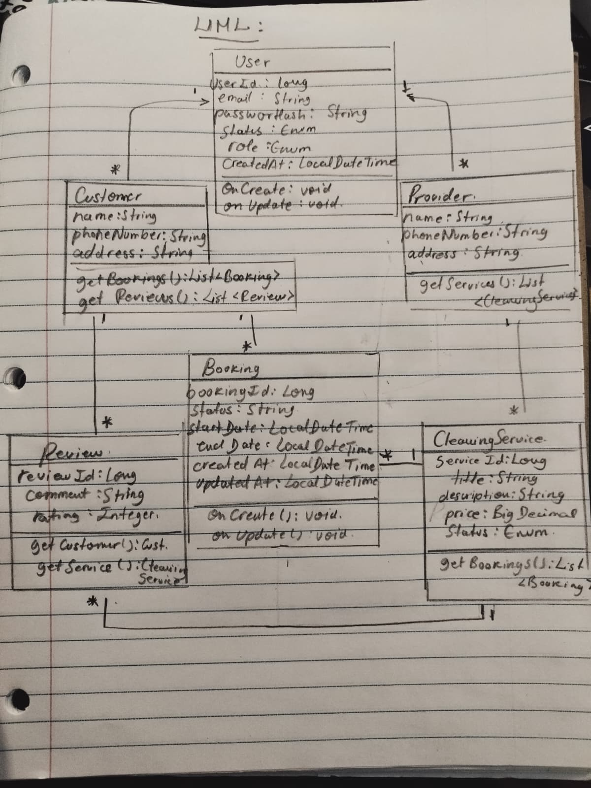

# CleanSweep - Backend API Documentation

**Version:** 1.0
**Last Updated:** March 18, 2026
**Base URL:** `http://localhost:8080/api`

---

## Table of Contents

1. [Overview](#1-overview)
2. [User Roles](#2-user-roles)
3. [UML Class Diagram](#3-uml-class-diagram)
4. [API Endpoints](#4-api-endpoints)
   - [Customer Management](#customer-management)
   - [Provider Management](#provider-management)
  
5. [Use Case Mapping](#5-use-case-mapping)
---
## 1. Overview
The LocalHarvest Hub Backend API provides a RESTful interface for managing: 

- **User Accounts**: Customer, Provider, and SysAdmin roles
- **Provider Profiles**: Information about provider and their operations
- **Services**: Seasonal produce offerings with pricing and capacity management
- **Bookingss**: Customer bookings to services with various cadences
- **Reviews**: Customer feedback on freshness and delivery experiences
---
## 2. User Roles
The API supports three primary user roles:

| Role | Description | Primary Responsibilities |
|------|-------------|-------------------------|
| **CUSTOMER** | Consumer of services | Browse provider/service, book, write reviews |
| **PROVIDER** | Provider of services | Create/manage service, view metrics, reply to reviews |
---
## 3. UML Class Diagram


## 4. API Endpoints
**Note:** Users are created through role-specific endpoints (`/customers`, `/providers`), not through a generic `/users` endpoint. This ensures proper role assignment and role-specific attributes.

### Customer Management
#### Create Customer
**Endpoint:** `POST /api/customers`
**Use Case:** US-CUST-001 (Register as Customer)
**Description:** Create a new customer account with profile information.

```http
POST /api/customers
Content-Type: application/json

{
  "email": "jane@example.com",
  "passwordHash": "hashed_password",
  "status": "ACTIVE",
  "role": "CUSTOMER",
  "name": "Jane Doe"
}
```
**Response:**
{
  "userId": 1,
  "email": "jane@example.com",
  "status": "ACTIVE",
  "role": "CUSTOMER",
  "name": "Jane Doe",
  "bookings": [],
  "createdAt": "2026-01-15T10:30:00",
  "updatedAt": "2026-01-15T10:30:00"
}


#### Get All Customers
**Endpoint:** `GET /api/customers`
**Use Case:** Admin user management
**Description:** Retrieve all customer accounts.

	{
		"name": "Rous Doe",
		"phoneNumber": "8723425652",
		"address": "1234 Table Rd",
		"createdAt": "2026-03-23T12:49:13.393696",
		"email": "jane@example.com",
		"passwordHash": "hashed_password",
		"role": "CUSTOMER",
		"status": "ACTIVE",
		"updatedAt": "2026-03-23T13:52:30.974126",
		"userId": 1
	},
	{
		"name": "John Smith",
		"phoneNumber": null,
		"address": null,
		"createdAt": "2026-03-23T17:53:27.238741",
		"email": "john@example.com",
		"passwordHash": "hashed_password",
		"role": "CUSTOMER",
		"status": "ACTIVE",
		"updatedAt": "2026-03-23T17:53:27.238741",
		"userId": 2
	}

---
#### Get Customer by ID
**Endpoint:** `GET /api/customers/{id}`
**Use Case:** Customer profile view
**Description:** Retrieve specific customer by ID.

```
GET /api/customers/1
```
{
	"name": "Rous Doe",
	"phoneNumber": "8723425652",
	"address": "1234 Table Rd",
	"createdAt": "2026-03-23T12:49:13.393696",
	"email": "jane@example.com",
	"passwordHash": "hashed_password",
	"role": "CUSTOMER",
	"status": "ACTIVE",
	"updatedAt": "2026-03-23T13:52:30.974126",
	"userId": 1
}

---
 #### Get All services
**Endpoint:** `GET /services`
**Use Case:** US-CUST-003 (Discover services)
**Description:** Retrieve all available services.

```http
GET /services
```
	{
		"serviceId": 7,
		"provider": {
			"name": "Demo Provider",
			"phoneNumber": "555-1234",
			"address": "123 Demo Street",
			"createdAt": "2026-03-23T21:01:15.983124",
			"email": "demo@example.com",
			"passwordHash": "hashed_password",
			"role": "PROVIDER",
			"status": "ACTIVE",
			"updatedAt": "2026-03-23T21:01:15.983124",
			"userId": 3
		},
		"title": "House Cleaning",
		"description": "Basic House Cleaning",
		"price": 50,
		"status": "ACTIVE"
	}
---

#### Get All services
**Endpoint:** `GET api/services/{serviceId}`
**Use Case:** US-CUST-003 (Discover services)
**Description:** Retrieve all available services by ID.

`
```http
GET api/services/8
****
```
{
	"serviceId": 8,
	"provider": {
		"name": "Demo Provider",
		"phoneNumber": "555-1234",
		"address": "123 Demo Street",
		"createdAt": "2026-03-23T21:01:15.983124",
		"email": "demo@example.com",
		"passwordHash": "hashed_password",
		"role": "PROVIDER",
		"status": "ACTIVE",
		"updatedAt": "2026-03-23T21:01:15.983124",
		"userId": 3
	},
	"title": "Office Cleaning",
	"description": "Deep Office Cleaning",
	"price": 120,
	"status": "ACTIVE"
}
---
---

#### Update Customer
**Endpoint:** `PUT api/customers/{id}`
**Use Case:** US-CUST-001 (Update Profile)
**Description:** Update customer profile information.

```http
PUT api/customers/4
Content-Type: application/json

{
  "email": "Milyy@example.com",
  "passwordHash": "hashed_password",
  "status": "ACTIVE",
  "role": "CUSTOMER",
  "name": "Miley Keith"
}
```
**Response:** {
 "name": "Miley Keith",
	"phoneNumber": null,
	"address": null,
	"createdAt": "2026-03-24T13:26:37.684967",
	"email": "Milyy@example.com",
	"passwordHash": "hashed_password",
	"role": "CUSTOMER",
	"status": "ACTIVE",
	"updatedAt": "2026-03-24T22:50:25.7121041",
	"userId": 4
}
---

#### Delete Customer
**Endpoint:** `DELETE api/customers/{id}`
**Use Case:** Account deletion
**Description:** Delete customer account.

```http
DELETE api/customers/8
```

**Status Code:** `204 No Content` or `404 Not Found`
[]
---
#### Booking a Service
**Endpoint:** `BOOK api/customers/{id}/book/{service_id}`
**Use Case:** Book a service
**Description:** Booking a service.

```http
BOOK api/customers/4/book/9
```
`{
	"serviceId": 8,
	"provider": {
		"name": "Demo Provider",
		"phoneNumber": "555-1234",
		"address": "123 Demo Street",
		"createdAt": "2026-03-23T21:01:15.983124",
		"email": "demo@example.com",
		"passwordHash": "hashed_password",
		"role": "PROVIDER",
		"status": "ACTIVE",
		"updatedAt": "2026-03-23T21:01:15.983124",
		"userId": 3
	},
	"title": "Office Cleaning",
	"description": "Deep Office Cleaning",
	"price": 120,
	"status": "ACTIVE"
}

---
#### Review a service
**Endpoint:** `REVIEW api/customers/{id}/review/{book_id}`
**Use Case:** Leave a review to a service.
**Description:** Review a service.

```http
REVIEW api/customers/2/review/6
```


	"reviewId": 10,
	"customer": {
		"name": "John Smith",
		"phoneNumber": null,
		"address": null,
		"createdAt": "2026-03-23T17:53:27.238741",
		"email": "john@example.com",
		"passwordHash": "hashed_password",
		"role": "CUSTOMER",
		"status": "ACTIVE",
		"updatedAt": "2026-03-23T17:53:27.238741",
		"userId": 2
	},
	"service": {
		"serviceId": 9,
		"provider": {
			"name": "Demo Provider",
			"phoneNumber": "555-1234",
			"address": "123 Demo Street",
			"createdAt": "2026-03-23T21:01:15.983124",
			"email": "demo@example.com",
			"passwordHash": "hashed_password",
			"role": "PROVIDER",
			"status": "ACTIVE",
			"updatedAt": "2026-03-23T21:01:15.983124",
			"userId": 3
		},
		"title": "Window Cleaning",
		"description": "Window Cleaning",
		"price": 80,
		"status": "ACTIVE"
	},
	"booking": {
		"bookingId": 6,
		"customer": {
			"name": "John Smith",
			"phoneNumber": null,
			"address": null,
			"createdAt": "2026-03-23T17:53:27.238741",
			"email": "john@example.com",
			"passwordHash": "hashed_password",
			"role": "CUSTOMER",
			"status": "ACTIVE",
			"updatedAt": "2026-03-23T17:53:27.238741",
			"userId": 2
		},
		"service": {
			"serviceId": 9,
			"provider": {
				"name": "Demo Provider",
				"phoneNumber": "555-1234",
				"address": "123 Demo Street",
				"createdAt": "2026-03-23T21:01:15.983124",
				"email": "demo@example.com",
				"passwordHash": "hashed_password",
				"role": "PROVIDER",
				"status": "ACTIVE",
				"updatedAt": "2026-03-23T21:01:15.983124",
				"userId": 3
			},
			"title": "Window Cleaning",
			"description": "Window Cleaning",
			"price": 80,
			"status": "ACTIVE"
		},
		"status": "ACTIVE",
		"startDate": "2026-03-24T00:00:00",
		"endDate": "2026-03-25T00:00:00",
		"createdAt": "2026-03-24T00:32:45.119218",
		"updatedAt": "2026-03-24T00:32:45.119218"
	},
	"comment": "Good service.",
	"rating": 5,
	"createdAt": "2026-03-24T22:27:55.6887657",
	"updatedAt": "2026-03-24T22:27:55.6887657"

---


-----------------------------------------------------------------------------------------------------------
--------------------------------------------------------------------------------------------------------------


### Provider/Provider Management

#### Create Provider
**Endpoint:** `POST /providers`
**Use Case:** US-FARM-001 (Register as Provider)
**Description:** Create a new provider account.

```http
POST /providers
Content-Type: application/json

{
  "email": "john@example.com",
  "passwordHash": "hashed_password",
  "status": "ACTIVE",
  "role": "PROVIDER",
  "name": "John Smith"
}
```

**Response:**
```json
{
  "userId": 2,
  "email": "john@example.com",
  "status": "ACTIVE",
  "role": "PROVIDER",
  "name": "John Smith",
  "provider": null,
  "createdAt": "2026-01-15T10:30:00",
  "updatedAt": "2026-01-15T10:30:00"
}
```

**Status Code:** `201 Created`

---

#### Get All Providers
**Endpoint:** `GET /providers`
**Use Case:** Browse providers
**Description:** Retrieve all provider accounts.

```http
GET /providers
```

**Status Code:** `200 OK`

---

#### Get Provider by ID
**Endpoint:** `GET /providers/{id}`
**Use Case:** Provider profile view
**Description:** Retrieve specific provider by ID.

```http
GET /providers/2
```

**Status Code:** `200 OK` or `404 Not Found`

---

#### Get Provider by Email
**Endpoint:** `GET /providers/email/{email}`
**Use Case:** Provider lookup
**Description:** Retrieve provider by email address.

```http
GET /providers/email/john@example.com HTTP/1.1
```

**Status Code:** `200 OK` or `404 Not Found`

---

#### Update Provider
**Endpoint:** `PUT /providers/{id}`
**Use Case:** US-FARM-001 (Update Profile)
**Description:** Update provider profile information.

```http
PUT /providers/2
Content-Type: application/json

{
  "bio": "Third Generation Provider specializing in organic vegetables. Passionate about sustainable agriculture and community engagement.",
  "status": "ACTIVE"
}
```

**Response:** Updated provider object

**Status Code:** `200 OK` or `404 Not Found`

---

#### Delete Provider
**Endpoint:** `DELETE /providers/{id}`
**Use Case:** Account deletion
**Description:** Delete provider account.

```http
DELETE /providers/2
```

**Status Code:** `204 No Content` or `404 Not Found`

---
### Provider Management

#### Create Provider
**Endpoint:** `POST /provider`
**Use Case:** US-FARM-001 (Create Provider Profile)
**Description:** Create a new provider profile.

```http
POST /provider
Content-Type: application/json

{
  "provider": {
    "userId": 2
  },
  "name": "Green Valley Provider",
  "location": "Chapel Hill, NC 27514",
  "description": "Organic family provider specializing in seasonal produce with sustainable practices."
}
```

**Response:**
```json
{
  "providerId": 5,
  "provider": {
    "userId": 2,
    "email": "john@example.com"
  },
  "name": "Green Valley Provider",
  "location": "Chapel Hill, NC 27514",
  "description": "Organic family provider specializing in seasonal produce with sustainable practices.",
  "Services": [],
  "createdAt": "2026-01-15T10:30:00",
  "updatedAt": "2026-01-15T10:30:00"
}
```

**Status Code:** `201 Created`

---

#### Get All provider
**Endpoint:** `GET /provider`
**Use Case:** US-CUST-002 (Browse Provider Profiles)
**Description:** Retrieve all provider.

```http
GET /provider
```

**Response:**
```json
[
  {
    "providerId": 5,
    "provider": {...},
    "name": "Green Valley Provider",
    "location": "Chapel Hill, NC 27514",
    "description": "...",
    "Services": [...]
  }
]
```

**Status Code:** `200 OK`

---

#### Get Provider by ID
**Endpoint:** `GET /provider/{id}`
**Use Case:** US-CUST-002 (View Provider Details)
**Description:** Retrieve specific provider profile.

```http
GET /provider/5
```

**Status Code:** `200 OK` or `404 Not Found`

---

#### Update Provider
**Endpoint:** `PUT /provider/{id}`
**Use Case:** US-FARM-001 (Update Provider Profile)
**Description:** Update provider profile information.

```http
PUT /provider/5
Content-Type: application/json

{
  "description": "Updated provider description...",
  "location": "Chapel Hill, NC 27516"
}
```

**Response:** Updated provider object

**Status Code:** `200 OK` or `404 Not Found`

---

#### Delete Provider
**Endpoint:** `DELETE /provider/{id}`
**Use Case:** Provider removal
**Description:** Delete provider profile.

```http
DELETE /provider/5
```

**Status Code:** `204 No Content` or `404 Not Found`

---

### Service Management

#### Create Service
**Endpoint:** `POST /service`
**Use Case:** US-FARM-002 (Create Service - Service)
**Description:** Create a new service offering.

```http
POST /service
Content-Type: application/json

{
  "provider": {
    "providerId": 5
  },
  "title": "Spring Veggie Box",
  "description": "Fresh spring vegetables including lettuce, spinach, peas...",
  "season": "SPRING",
  "produce": "Lettuce, Spinach, Peas, Carrots, Radishes",
  "price": 35.99,
  "capacity": 50,
  "status": "PUBLISHED",
  "pickupDeliveryNotes": "Thursday pickup or Friday delivery"
}
```

**Response:**
```json
{
  "serviceId": 10,
  "provider": {
    "providerId": 5,
    "name": "Green Valley Provider"
  },
  "title": "Spring Veggie Box",
  "description": "Fresh spring vegetables including lettuce, spinach, peas...",
  "season": "SPRING",
  "produce": "Lettuce, Spinach, Peas, Carrots, Radishes",
  "price": 35.99,
  "capacity": 50,
  "status": "PUBLISHED",
  "cadence": "WEEKLY",
  "pickupDeliveryNotes": "Thursday pickup or Friday delivery",
  "createdAt": "2026-01-15T10:30:00",
  "updatedAt": "2026-01-15T10:30:00"
}
```

**Status Code:** `201 Created`

---

#### Get All services
**Endpoint:** `GET /service`
**Use Case:** US-CUST-003 (Discover services)
**Description:** Retrieve all available services.

```http
GET /service
```

**Query Parameters:**
- `season` (Optional): Filter by season (SPRING, SUMMER, FALL, WINTER)
- `price` (Optional): Filter by maximum price
- `status` (Optional): Filter by status (PUBLISHED, SUSPENDED, PENDING)

**Example with filters:**
```http
GET /service?season=SPRING&price=40
```

**Status Code:** `200 OK`

---

#### Get Service by ID
**Endpoint:** `GET /service/{id}`
**Use Case:** US-CUST-004 (View Service Details)
**Description:** Retrieve specific service with full details.

```http
GET /service/10
```

**Response:** See Create Service endpoint

**Status Code:** `200 OK` or `404 Not Found`

---

#### Get services by Provider ID
**Endpoint:** `GET /service/provider/{providerId}`
**Use Case:** US-CUST-003 (Browse Boxes by Provider)
**Description:** Retrieve all services from a specific provider.

```http
GET /service/provider/5
```

**Response:** Array of services

**Status Code:** `200 OK`

---

#### Get services by Status
**Endpoint:** `GET /service/status/{status}`
**Use Case:** US-FARM-002 (View Box Listings)
**Description:** Retrieve service filtered by status.

```http
GET /service/status/PUBLISHED
```

**Response:** Array of services with matching status

**Status Code:** `200 OK`

---

#### Update Service
**Endpoint:** `PUT /service/{id}`
**Use Case:** US-FARM-003 (Update Harvest Schedule), US-FARM-004 (Edit/Suspend Box)
**Description:** Update service information, including capacity and status.

```http
PUT /service/10
Content-Type: application/json

{
  "capacity": 40,
  "status": "SUSPENDED",
  "updatedAt": "2026-01-15T10:30:00"
}
```

**Response:** Updated service object

**Status Code:** `200 OK` or `404 Not Found`

---

#### Delete Service
**Endpoint:** `DELETE /service/{id}`
**Use Case:** Box removal
**Description:** Delete a service listing.

```http
DELETE /service/10 HTTP/1.1
```

**Status Code:** `204 No Content` or `404 Not Found`

---
### Booking Management

#### Create Booking
**Endpoint:** `POST /bookings`
**Use Case:** US-CUST-005 (book to Service)
**Description:** Create a new booking to a service.

```http
POST /bookings
Content-Type: application/json

{
  "customer": {
    "userId": 1
  },
  "Services": {
    "serviceId": 10
  },
  "cadence": "WEEKLY",
  "startDate": "2026-01-20",
  "status": "ACTIVE"
}
```

**Response:**
```json
{
  "bookingId": 101,
  "customer": {
    "userId": 1,
    "email": "jane@example.com"
  },
  "Services": {
    "serviceId": 10,
    "title": "Spring Veggie Box"
  },
  "cadence": "WEEKLY",
  "startDate": "2026-01-20",
  "endDate": null,
  "status": "ACTIVE",
  "createdAt": "2026-01-15T10:30:00",
  "updatedAt": "2026-01-15T10:30:00"
}
```

**Status Code:** `201 Created`

---

#### Get All bookings
**Endpoint:** `GET /bookings`
**Use Case:** Admin booking management
**Description:** Retrieve all bookings.

```http
GET /bookings
```

**Status Code:** `200 OK`

---

#### Get Booking by ID
**Endpoint:** `GET /bookings/{id}`
**Use Case:** Booking detail view
**Description:** Retrieve specific booking.

```http
GET /bookings/101
```

**Status Code:** `200 OK` or `404 Not Found`

---

#### Get bookings by Customer ID
**Endpoint:** `GET /bookings/customer/{customerId}`
**Use Case:** US-CUST-001 (Manage Customer bookings)
**Description:** Retrieve all bookings for a specific customer.

```http
GET /bookings/customer/1
```

**Response:** Array of customer bookings

**Status Code:** `200 OK`

---

#### Get bookings by Service ID
**Endpoint:** `GET /bookings/service/{serviceId}`
**Use Case:** US-FARM-006 (View Customer Engagement Metrics)
**Description:** Retrieve all bookings to a specific service.

```http
GET /bookings/service/10
```

**Response:** Array of bookings to the service

**Status Code:** `200 OK`

---

#### Get bookings by Status
**Endpoint:** `GET /bookings/status/{status}`
**Use Case:** Booking status filtering
**Description:** Retrieve bookings filtered by status.

```http
GET /bookings/status/ACTIVE
```

**Response:** Array of bookings with matching status

**Status Code:** `200 OK`

---

#### Update Booking
**Endpoint:** `PUT /bookings/{id}`
**Use Case:** US-CUST-006 (Manage Booking - Pause/Skip/Change/Cancel)
**Description:** Update booking cadence, status, or end date.

```http
PUT /bookings/101
Content-Type: application/json

{
  "cadence": "BIWEEKLY",
  "status": "PAUSED",
  "endDate": null
}
```

**Common Status Updates:**

**Pause Booking:**
```json
{
  "status": "PAUSED"
}
```

**Cancel Booking:**
```json
{
  "status": "CANCELLED",
  "endDate": "2026-02-15"
}
```

**Change Cadence:**
```json
{
  "cadence": "MONTHLY"
}
```

**Response:** Updated booking object

**Status Code:** `200 OK` or `404 Not Found`

---

#### Delete Booking
**Endpoint:** `DELETE /bookings/{id}`
**Use Case:** Booking removal
**Description:** Delete a booking (hard delete).

```http
DELETE /bookings/101
```

**Status Code:** `204 No Content` or `404 Not Found`

---
### Review Management

#### Create Review
**Endpoint:** `POST /reviews`
**Use Case:** US-CUST-007 (Write a Review)
**Description:** Create a new review for a completed booking.

```http
POST /reviews
Content-Type: application/json

{
  "booking": {
    "bookingId": 101
  },
  "cleanlinessRating": 5,
  "punctualityRating  ": 4,
  "qualityRating": 5,
  "comment": "Great quality produce and reliable delivery! The vegetables were fresh and the timing was perfect."
}
```

**Response:**
```json
{
  "reviewId": 201,
  "booking": {
    "bookingId": 101
  },
  "cleanlinessRating": 5,
  "punctualityRating  ": 4,
  "qualityRating": 5,
  "comment": "Great quality produce and reliable delivery! The vegetables were fresh and the timing was perfect.",
  "replyText": null,
  "createdAt": "2026-01-25T10:30:00",
  "updatedAt": "2026-01-25T10:30:00"
}
```

**Validation Rules:**
- `cleanlinessRating`, `punctualityRating  `, `qualityRating`: Must be between 1 and 5
- Review can only be created within 14-30 days of booking completion
- Each booking can have only one review

**Status Code:** `201 Created`

---

#### Get All Reviews
**Endpoint:** `GET /reviews`
**Use Case:** US-CUST-008 (Read Reviews)
**Description:** Retrieve all reviews in the system.

```http
GET /reviews
```

**Status Code:** `200 OK`

---

#### Get Review by ID
**Endpoint:** `GET /reviews/{id}`
**Use Case:** Review detail view
**Description:** Retrieve specific review.

```http
GET /reviews/201
```

**Status Code:** `200 OK` or `404 Not Found`

---

#### Get Reviews by Booking ID
**Endpoint:** `GET /reviews/booking/{bookingId}`
**Use Case:** US-CUST-008 (Read Reviews for Booking)
**Description:** Retrieve all reviews for a specific booking.

```http
GET /reviews/booking/101
```

**Response:** Array of reviews for the booking

**Status Code:** `200 OK`

---

#### Update Review
**Endpoint:** `PUT /reviews/{id}`
**Use Case:** US-FARM-007 (Reply to Reviews)
**Description:** Update review (provider reply or re-scoring).

```http
PUT /reviews/201
Content-Type: application/json

{
  "cleanlinessRating": 5,
  "punctualityRating  ": 4,
  "qualityRating": 5,
  "comment": "Updated comment...",
  "replyText": "Thank you for the wonderful review! We're glad you enjoyed the fresh vegetables."
}
```

**Response:** Updated review object

**Status Code:** `200 OK` or `404 Not Found`

---

#### Delete Review
**Endpoint:** `DELETE /reviews/{id}`
**Use Case:** US-ADMIN-003 (Moderate Reviews - Remove)
**Description:** Delete a review (admin moderation).

```http
DELETE /reviews/201
```

**Status Code:** `204 No Content` or `404 Not Found`

---


## 5. Use Case Mapping
The API endpoints are designed to support the following SRS use cases:

### Customer Use Cases

| Use Case | Description | Related Endpoints |
|----------|-------------|-------------------|
| **US-CUST-001** | Register & manage customer profile | `POST /customers`, `PUT /customers/{id}` |
| **US-CUST-002** | Browse provider profiles | `GET /provider`, `GET /provider/{id}` |
| **US-CUST-003** | Discover services (filter & sort) | `GET /service`, `GET /service/provider/{providerId}`, `GET /service/status/{status}` |
| **US-CUST-004** | View service details | `GET /service/{id}` |
| **US-CUST-005** | book to service | `POST /bookings` |
| **US-CUST-006** | Manage booking (pause/skip/change/cancel) | `PUT /bookings/{id}` |
| **US-CUST-007** | Write a review | `POST /reviews` |
| **US-CUST-008** | Read reviews | `GET /reviews`, `GET /reviews/booking/{bookingId}` |

### Provider (Provider) Use Cases

| Use Case | Description | Related Endpoints |
|----------|-------------|-------------------|
| **US-FARM-001** | Register & manage provider profile | `POST /providers`, `PUT /providers/{id}`, `POST /provider`, `PUT /provider/{id}` |
| **US-FARM-002** | Create service offering | `POST /service` |
| **US-FARM-003** | Update harvest schedule & quantities | `PUT /service/{id}` |
| **US-FARM-004** | Edit or suspend service | `PUT /service/{id}` |
| **US-FARM-005** | Manage capacity (sold out) | `PUT /service/{id}` |
| **US-FARM-006** | View customer engagement metrics | `GET /bookings/service/{serviceId}` |
| **US-FARM-007** | Reply to customer reviews | `PUT /reviews/{id}` |

